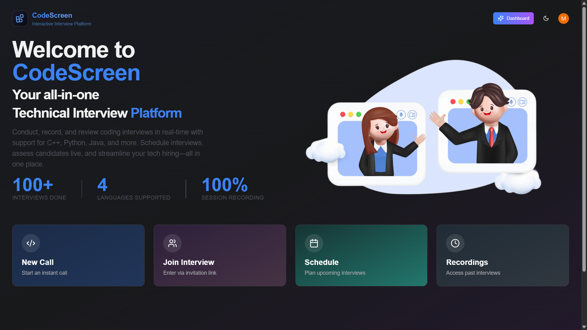
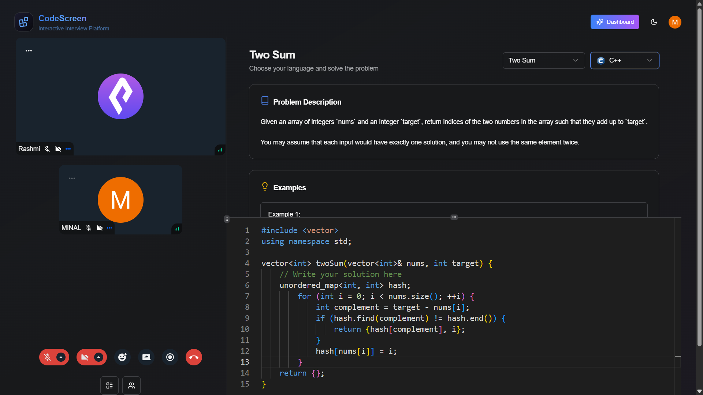

# CodeScreen

## Overview

CodeScreen is an advanced online interview platform designed to streamline the technical interview process. Developed using **Next.js**, **TypeScript**, **Stream**, **Convex**, and **NextAuth.js with Google OAuth**, the platform facilitates seamless interview experiences with video calls, **real-time collaborative code editing**, and interview feedback capabilities. CodeScreen offers a dynamic environment for interviewers and interviewees, making technical assessments more effective and collaborative.




---

## Problem/Why?

Technical interviews can often be unstructured and challenging to manage, leading to inefficient assessments. CodeScreen addresses these issues by providing a unified platform for video calls, screen sharing, **real-time collaborative code editing**, and structured feedback, ensuring a seamless interview experience for both interviewers and candidates.

---

## Background

With the increasing demand for remote technical interviews, CodeScreen aims to replicate the efficiency of in-person assessments. Utilizing modern web technologies and frameworks, the platform facilitates real-time interaction, effective problem-solving, and structured evaluation with **multi-user collaborative coding sessions**.

---

## Core Features

### **Interview Experience:**

- **Video Call Panel:** Real-time video calls with screen sharing and recording capabilities.
- **Reactions & Feedback:** Emoji reactions for non-verbal communication.
- **Screen Recording:** Capture interview sessions for future review.

### **Problem Solving:**

- **DSA Question Panel:** Display problems with detailed descriptions, constraints, and test cases.
- **Real-time Collaborative Code Editor:** Multi-user code editing with live synchronization supporting C++, Java, and Python.
- **Language Synchronization:** When one user changes the programming language, it syncs to all participants in real-time.
- **Question Synchronization:** When one user changes the coding question, it syncs to all participants in real-time.
- **User Presence:** See who is currently connected to the collaborative editing session.
- **Connection Status:** Visual indicators showing real-time connection status to the collaborative server.
- **Test Case Validation:** Validate code solutions against test cases provided by the interviewer.

### **Collaborative Features:**

- **Real-time Code Sync:** Multiple users can edit code simultaneously with live updates.
- **Room-based Collaboration:** Each meeting room has its own isolated collaborative space.
- **Automatic Reconnection:** Seamless reconnection if connection is lost.
- **User Activity Indicators:** Visual feedback showing active participants.
- **Cross-browser Compatibility:** Works across different browsers and devices.

### **Interviewer Utilities:**

- **Question Management:** Add, edit, and delete DSA questions with ease.
- **Interview Scheduling:** Schedule, start, and manage interview sessions.
- **Feedback System:** Provide structured feedback for each interview session.

### **Authentication & Authorization:**

- Secure authentication using **NextAuth.js with Google OAuth**.
- Role-based access control for interviewers and candidates.

---

## Technologies Used

- **Frontend:**

  - Next.js & TypeScript
  - Tailwind CSS & ShadCn for styling
  - Stream for real-time video communication
  - Monaco Editor for code editing
  - Socket.io for real-time collaborative features

- **Backend:**

  - Convex for data management and state synchronization
  - Server Components and Server Actions for optimized performance
  - Express.js for collaborative server
  - Socket.io server for real-time collaboration

- **Authentication:**
  - NextAuth.js with Google OAuth for user authentication and authorization

---

## Setup Instructions

### Prerequisites

- Node.js (v18 or higher)
- npm or yarn
- Google OAuth credentials
- Stream Video API keys
- Convex account

### Environment Variables:

Create a `.env.local` file in the root directory with the following variables:

```env
# Authentication
NEXTAUTH_URL=http://localhost:3000
NEXTAUTH_SECRET=your-nextauth-secret-key
GOOGLE_CLIENT_ID=your-google-client-id
GOOGLE_CLIENT_SECRET=your-google-client-secret

# Convex
CONVEX_DEPLOYMENT=your-convex-deployment
NEXT_PUBLIC_CONVEX_URL=your-convex-url

# Stream Video API
NEXT_PUBLIC_STREAM_API_KEY=your-stream-api-key
STREAM_SECRET_KEY=your-stream-secret-key
```

### Installation & Running

1. **Install dependencies:**

   ```bash
   npm install
   ```

2. **Start the collaborative server** (in a separate terminal):

   ```bash
   npm run collaborative-server
   ```

   This starts the collaborative server on port 5001.

3. **Start the Next.js development server** (in another terminal):

   ```bash
   npm run dev
   ```

   This starts the application on `http://localhost:3000`.

4. **Access the application:**
   - Open `http://localhost:3000` in your browser
   - Sign in with Google OAuth
   - Create or join a meeting room

### Getting Stream API Keys

1. Go to [Stream Dashboard](https://dashboard.getstream.io/)
2. Create a new app or use an existing one
3. Go to the "API Keys" section
4. Copy your **API Key** and **Secret Key**
5. Add them to your `.env.local` file

---

## How to Use

### Creating a Meeting

1. Sign in to CodeScreen
2. Navigate to the schedule page
3. Create a new meeting
4. Share the meeting URL with participants

### Joining a Meeting

1. Click on the meeting URL shared by the organizer
2. The collaborative code editor will automatically connect to the room
3. You'll see real-time sync indicators and user presence

### Collaborative Features

- **Code Editing:** Any changes you make to the code will be visible to all other participants in real-time
- **Language Selection:** When you change the programming language, it will sync to all participants
- **Question Selection:** When you change the coding question, it will sync to all participants
- **User Presence:** See who is currently connected to the collaborative session
- **Connection Status:** Green/red indicators show your connection status to the collaborative server

---

## Architecture

### Collaborative Server

The collaborative server handles:

- WebSocket connections for real-time communication
- Room management (users joining/leaving)
- Code, language, and question synchronization
- User presence tracking
- Automatic cleanup when rooms are empty

### Client Architecture

The collaborative editor:

- Connects to the collaborative server via WebSocket
- Syncs code changes, language changes, and question changes
- Shows user presence and connection status
- Handles automatic reconnection
- Provides real-time feedback

### Room Management

- Each meeting room is identified by the meeting ID from the URL
- Users automatically join the room when they visit the meeting page
- Room data persists as long as at least one user is connected
- When all users leave, the room data is cleared

---

## Troubleshooting

### Connection Issues

1. **Collaborative server not connecting:**

   - Make sure the collaborative server is running: `npm run collaborative-server`
   - Check that port 5001 is not blocked by firewall
   - Verify the server URL in the client code

2. **Video call not connecting:**
   - Check that Stream API keys are correctly configured
   - Verify you're using Video API keys (not Chat API keys)
   - Check browser console for error messages

### Sync Issues

1. **Code not syncing:**

   - Check browser console for error messages
   - Verify all users are connected to the same room
   - Try refreshing the page if sync stops working

2. **Language/Question not syncing:**
   - Ensure all participants are connected to the collaborative server
   - Check connection status indicators

### Performance Issues

- The collaborative server is designed for small to medium-sized rooms
- For large rooms, consider implementing additional optimizations
- Monitor server resources if you have many concurrent users

---

## Security Considerations

- The current implementation is for development/demo purposes
- For production use, consider adding:
  - Authentication for room access
  - Rate limiting for socket events
  - Input validation and sanitization
  - HTTPS for secure WebSocket connections
  - Environment-specific configurations

---

## Future Enhancements

- Integration with third-party coding platforms (e.g., Codeforces, LeetCode)
- Advanced analytics for interview feedback
- Support for additional programming languages
- Enhanced collaborative features (cursor tracking, selection sync)
- Recording collaborative sessions
- Advanced user permissions and roles

---

CodeScreen redefines technical interviews by combining modern technologies to create a structured, interactive, and effective assessment environment with real-time collaborative capabilities that make remote interviews as effective as in-person sessions.
